# RAPPORT
#### ⭐ Ne garder que le vert - `keep_green_only()`

| Avant | Après |
|-------|-------|
|  | 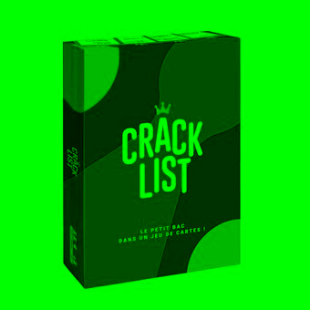 |

---
#### ⭐ Échanger les canaux - `swap_canals()`

| Avant | Après |
|-------|-------|
|  |  |

---

#### ⭐ Noir & Blanc - `black_and_white()`

| Avant | Après |
|-------|-------|
|  |  |

---

#### ⭐ Négatif - `negatif()`

| Avant | Après |
|-------|-------|
|  | 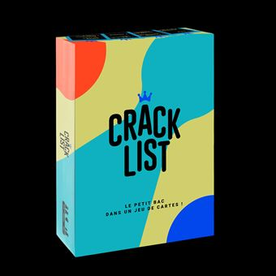 |

---

#### ⭐ Dégradé - `gradient()`

| Avant | Après |
|-------|-------|
| / / / / |  |

---

#### ⭐⭐ Miroir - `mirror()`

| Avant | Après |
|-------|-------|
|  | 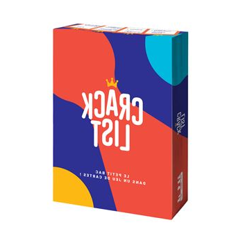 |

---

#### ⭐⭐ Image bruitée - `noise()`

| Avant | Après |
|-------|-------|
|  | 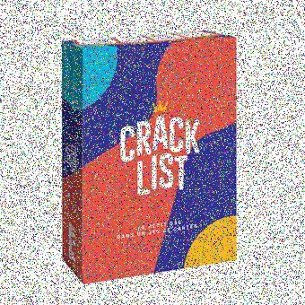 |

---

#### ⭐⭐ Rotation de 90° - `rotate()`

| Avant | Après |
|-------|-------|
|  |  |

---

#### ⭐⭐ RGB split - `split()`

| Avant | Après |
|-------|-------|
|  |  |

---

#### ⭐⭐ Luminosité - `lighting()`

| Avant | Après |
|-------|-------|
|  |  |

---

#### ⭐⭐(⭐) Disque - `draw_circle()`

| Avant | Après |
|-------|-------|
| / / / / |  |

---

#### ⭐ Cercle (vide) - `draw_empty_circle()`

| Avant | Après |
|-------|-------|
| / / / / | 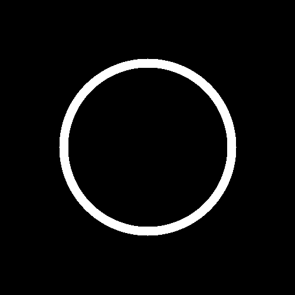 |

---

#### ⭐⭐ Animation - `animation()`

| Avant | Après |
|-------|-------|
| / / / / | 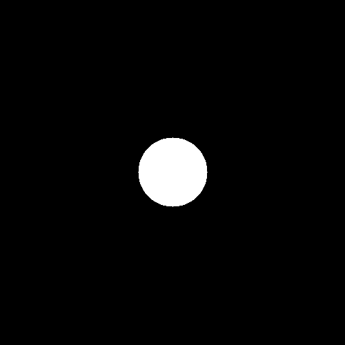 |

---

#### ⭐⭐⭐ Rosace - `rosace()`

| Avant | Après |
|-------|-------|
| / / / / | 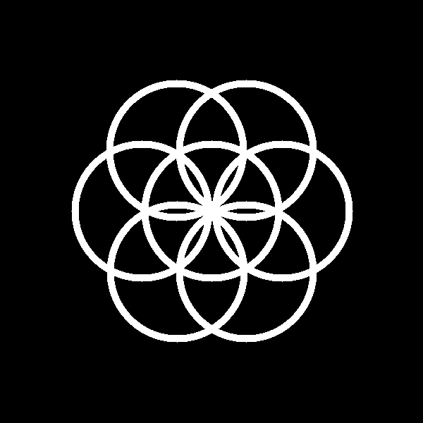 |

---

#### ⭐⭐ Mosaïque - `mosaique()`

| Avant | Après |
|-------|-------|
|  | 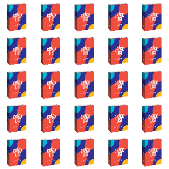 |

_Pour cet exercice j'ai pris 1 pixel sur 5 de l'image originale pour les placer à la suite ce qui a rétréci l'image, et ensuite j'ai dupliqué_

---

#### ⭐⭐⭐⭐ Mosaïque miroir - `mosaique_mirror()`

| Avant | Après |
|-------|-------|
|  | 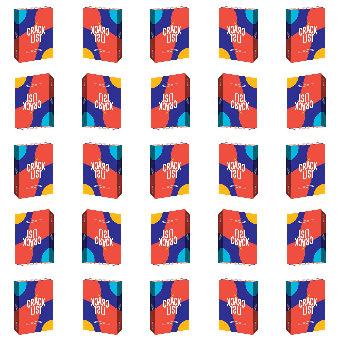 |

---

#### ⭐⭐⭐ Glitch - `glitch()`

| Avant | Après |
|-------|-------|
|  | 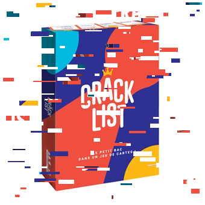 |

---

#### ⭐⭐⭐ Tri de pixels - `pixel_sorting()`

| Avant | Après |
|-------|-------|
|  | 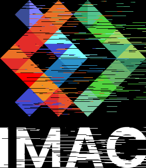 |

_Dans cet exercice j'ai eu du mal à trouver comment l'image originale a été faite.
J'ai crée un tableau qui trie les pixels de chaque ligne indépendament, ensuite j'ai utilisé la fonction `random_int` pour appliquer l'effet à 1 ligne sur 2. Et enfin j'ai fait en sorte que une seule portion de la ligne qui soit triée_

---

#### ⭐⭐⭐(⭐) Dégradés dans l'espace de couleur Lab - `color_gradient()`

| Avant | Après |
|-------|-------|
|  | 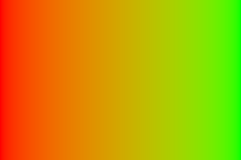 |

_J'ai beaucoup aimé la vidéo minecraft pour expliquer le sujet_

---

#### ⭐⭐⭐(⭐) Tramage - `tramage()`

| Avant | Après |
|-------|-------|
|  |  |

_J'ai lu l'article **Ditherpunk** en entier et je l'ai trouvé super intéressant!
J'ai réutilisé la matrice de Bayer et appliqué le principe Ordered Dithering. Comme l'image était claire, j'ai pas inversé le seuil `(1 - Bayer value)`, comme l'auteur de l'article_

---

#### ⭐⭐⭐(⭐) Normalisation de l'histogramme - `normalisation()`

| Avant | Après |
|-------|-------|
|  |  |

---

#### ⭐⭐⭐⭐ Vortex - `vortex()`

| Avant | Après |
|-------|-------|
|  |  |

---

#### ⭐⭐⭐⭐ Convolutions - `convolutions()`

| Avant | Après |
|-------|-------|
|  |  |

---

#### ⭐⭐⭐⭐⭐ Filtre de Kuwahara (effet peinture à l'huile) - `kuwahara()`

| Avant | Après | Avec l'effet noise |
|-------|-------|-------|
|  |  |  |

_Au début j'ai cru qu'il fallait obligatoirement appliquer l'effet `noise` pour que ça fonctionne, à cause la vidéo donnée dans l'exercice, et l'effet était bizarre mais après j'ai compris que c'était pas nécessaire_

---